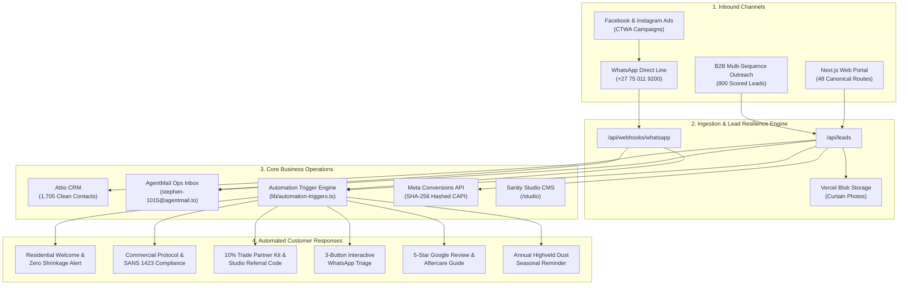
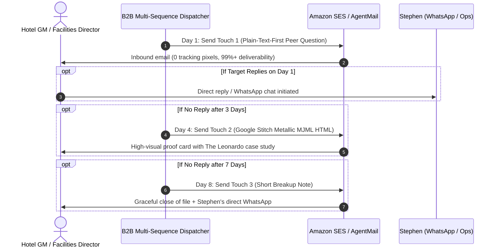

# JHB Curtain Cleaning — Master Systems Operations & Onboarding Manual

**Platform:** JHB Curtain Cleaning Digital Operating System (`jhbcurtaincleaning.co.za`)  
**Primary Operator:** Stephen (+27 75 011 9200 / `info@jhbcurtaincleaning.co.za`)  
**Autonomous Ops Inbox:** `stephen-1015@agentmail.to`  
**System Release:** v0.5.0 Enterprise Architecture

---

## 1. Master System Architecture & Data Flow



---

## 2. Lead Capture & Ingestion Engine

### A. The 3 Core Intake Points

1. **Residential Assessment Wizard (`/quote`)**:
   - Captures client name, mobile, email, suburb, curtain fabric types, and up to 3 curtain photo attachments.
   - Automatically stores images securely in Vercel Blob (`lead-photos/`).
   - Automatically triggers the **Residential Welcome Response** ("Do Not Take Down" zero shrinkage guidance).

2. **Commercial & Hospitality Assessment (`/commercial-assessment`)**:
   - Captures corporate facility / hotel details, room count, and operational timeline.
   - Automatically sends the **Commercial Protocol & SANS 1423 Fire Retardancy Summary**.

3. **10% Trade Partner Hub (`/trade`)**:
   - Captures interior decorator & curtain workroom applications.
   - Features an interactive **Passive Revenue Calculator**.
   - Automatically generates a unique **Studio Partner Referral Code** (e.g. `TRADE-HYDEPA-4821`).

---

## 3. Autonomous B2B Email Outreach Engine



### Outreach Commands & Execution:

```powershell
# 1. Audit all 19 email templates against 30+ spam deliverability rules:
python scripts/audit_spam_score.py

# 2. Launch Outreach to 200 Hotel General Managers:
# Day 1 Plain Text (Warm-up batch of 10):
python scripts/b2b_multi_sequence_dispatcher.py --segment hotel --touch 1 --limit 10 --delay 3.0

# Day 4 High-Visual MJML Follow-up:
python scripts/b2b_multi_sequence_dispatcher.py --segment hotel --touch 2 --limit 10 --delay 3.0

# 3. Launch Outreach to 200 Interior Designers (10% Trade Program):
python scripts/b2b_multi_sequence_dispatcher.py --segment design --touch 1 --limit 10 --delay 3.0
```

---

## 4. Meta (Facebook/Instagram Ads) & WhatsApp Cloud API

### WhatsApp Webhook Architecture

```
┌────────────────────────────────────────────────────────────────────────────────────────┐
│ 1. Customer taps Facebook/Instagram Ad ──▶ Opens WhatsApp (+27 75 011 9200)            │
└───────────────────────────────────────────┬────────────────────────────────────────────┘
                                            │
                                            ▼
┌────────────────────────────────────────────────────────────────────────────────────────┐
│ 2. Customer sends message or curtain photo                                             │
└───────────────────────────────────────────┬────────────────────────────────────────────┘
                                            │
                                            ▼
┌────────────────────────────────────────────────────────────────────────────────────────┐
│ 3. Meta Webhook triggers /api/webhooks/whatsapp                                        │
│ • Hub challenge verified with token: jhb_curtain_cleaning_meta_2026                    │
│ • Lead record created & immediate alert sent to stephen-1015@agentmail.to              │
└───────────────────────────────────────────┬────────────────────────────────────────────┘
                                            │
                                            ▼
┌────────────────────────────────────────────────────────────────────────────────────────┐
│ 4. Automated 3-Button Interactive Menu returned to Customer:                           │
│ • [Residential Clean]  • [Commercial / Hotel]  • [10% Trade Partner]                   │
└────────────────────────────────────────────────────────────────────────────────────────┘
```

---

## 5. Attio CRM Customer Database & Segmentation

All historical contacts (4,436 raw rows) were cleansed and segmented into **1,705 clean, deduplicated contacts**:

| Segment File | Target Audience | Lead Count | Primary Focus |
|---|---|---|---|
| `hotels_hospitality_200.csv` | Hotel GMs & Executive Housekeepers | 200 | Zero room downtime (10:00–14:00) |
| `corporate_facilities_200.csv` | Corporate Property & Facilities Heads | 200 | Boardrooms, blinds, SANS 1423 fire care |
| `interior_design_trade_200.csv` | Interior Decorators & Curtain Workrooms | 200 | 10% referral commission & handover care |
| `luxury_residential_200.csv` | Gated Estate & Luxury Homeowners | 200 | Double-volume in-situ silk/velvet care |

---

## 6. Branded Quotation & Commercial Proposal Engine

Stephen can generate formal, print-ready PDF proposals for any hotel or corporate client in 1 second:

```powershell
python scripts/generate_commercial_proposal.py `
  --client "David Sterling" `
  --company "The Leonardo Sandton" `
  --location "Sandton CBD" `
  --sector "Hotels & Hospitality" `
  --output "docs/proposals/leonardo_quotation.html"
```

**Quotation Output Features:**
- JHB Curtain Cleaning logo & metallic champagne styling.
- SANS 1423 Flame Retardant & Zero Shrinkage guarantee badges.
- Line-item scope, EFT banking details, signature lines, and one-click "Print / Save as PDF" button.

---

## 7. Content Management System (Sanity Studio CMS)

To publish case studies, client reviews, or local suburb guides without coding:
1. Open **[Live Sanity Studio (http://localhost:9999/studio)](http://localhost:9999/studio)** (or `https://www.jhbcurtaincleaning.co.za/studio`).
2. Login with your Sanity credentials (Project ID: `g5y9wcb1`).
3. Click **Case Studies** → **Create New** → Fill in the project details (e.g. "Sandhurst Double-Volume Residence") → Click **Publish**.

---

## 8. Daily Operational SOP for Stephen

```
┌────────────────────────────────────────────────────────────────────────────────────────┐
│                                 STEPHEN'S DAILY CHECKLIST                              │
├────────────────────────────────────────────────────────────────────────────────────────┤
│ 1. 07:30 AM ── Check AgentMail Ops Inbox (stephen-1015@agentmail.to)                   │
│    • Review incoming overnight quote requests & photo attachments                      │
│                                                                                        │
│ 2. 08:00 AM ── WhatsApp Assessment Confirmations (+27 75 011 9200)                     │
│    • Confirm arrival times with scheduled residential clients                          │
│                                                                                        │
│ 3. 09:00 AM ── Launch Daily B2B Outreach Batch                                         │
│    • Run: python scripts/b2b_multi_sequence_dispatcher.py --segment hotel --touch 1    │
│                                                                                        │
│ 4. 04:00 PM ── Generate Commercial Proposals for day's site inspections               │
│    • Run: python scripts/generate_commercial_proposal.py                               │
│                                                                                        │
│ 5. 05:30 PM ── Trigger 5-Star Google Review Solicitations for completed jobs           │
│    • Client automatically receives review email with link:                             │
│      https://g.page/r/CbZEjFiE3HjZEBM/review                                           │
└────────────────────────────────────────────────────────────────────────────────────────┘
```

---

## 9. Platform Test Suite & Maintenance Commands

| Action | Terminal Command | Target Result |
|---|---|---|
| **Run All Platform Tests** | `npm run test:all` | 6/6 test suites pass (Imports, TypeScript, Resilience, AgentMail, Meta, Triggers) |
| **Verify 48-Route Crawler** | `npm run test:crawl` | 48/48 routes return HTTP 200 OK |
| **Audit Spam Deliverability** | `python scripts/audit_spam_score.py` | 19/19 templates pass 100/100 |
| **Audit Google Search Index** | `python scripts/submit_gsc_indexing.py` | Submits sitemap and inspects all canonical routes |
| **Verify Meta & WhatsApp** | `python scripts/verify_meta_assets.py` | Verifies Meta IDs and webhook response |
